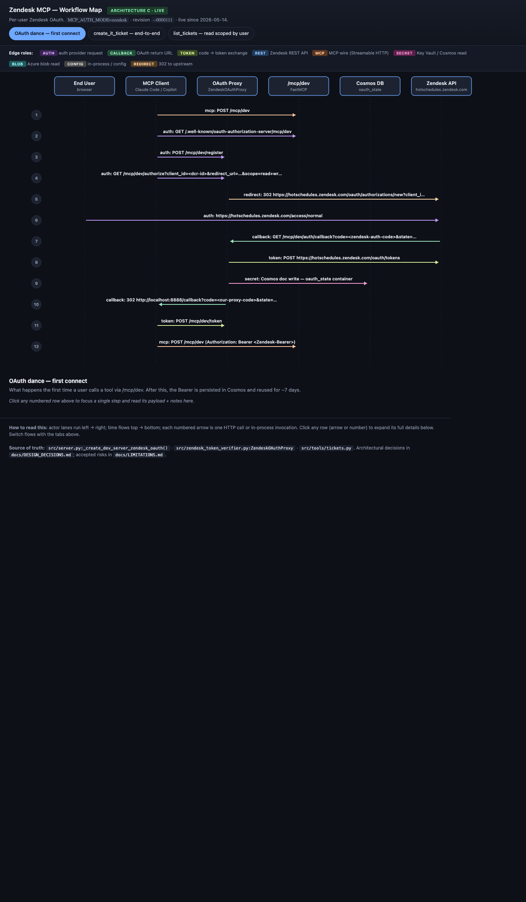

# Zendesk MCP — Security Overview

Internal Fourth tool. ~50 employees use it through their AI assistant (Claude, Copilot Studio, Cursor) to read and write tickets and Help Center articles in Zendesk. Users authenticate by signing into their Fourth Zendesk account.

## Where it runs

| | |
|---|---|
| Azure tenant | Fourth (`75cd3b18-…-ad4484fc72fe`) |
| Azure subscription | `engineering-csp` (`c9bed202-…-9a38d966f83e`) |
| Region · resource group | North Europe · `fourth-ai-prod` |
| Container | `fourth-zendesk-mcp-server` (image in ACR `fourthzendeskmcp`) |
| State stores | Cosmos `cosmos-db-ai-enablement` · Key Vault `mcp-kv-ai-enablement` |
| Observability | Log Analytics `fourth-ai-env-logs` · Defender for Containers + Key Vault (Standard) |

The container authenticates to Cosmos, Key Vault, the container registry, and Log Analytics via Managed Identity. Application secrets are stored in Key Vault; OAuth tokens are encrypted at rest in Cosmos.

## Architecture in one picture

```
   Fourth employee, in their AI assistant
                │   TLS + OAuth Bearer
                ▼
        Container App  fourth-zendesk-mcp-server
                │
       ┌────────┼─────────┐
       ▼        ▼         ▼
    Zendesk   Cosmos     Key Vault
    REST API  (encrypted (secrets)
              sessions)
```



## How users sign in

- Click a tool in your AI assistant for the first time.
- A browser tab opens on Zendesk's sign-in page.
- Sign in with your Fourth Zendesk credentials. The server never sees the password.
- Zendesk issues an opaque token. The server encrypts it (Fernet) and stores it.
- For the next ~7 days, calls reuse the token. No more sign-in prompts.

## How code reaches production

1. **Five automated checks** run in parallel on every code change — pytest, pip-audit, bandit, gitleaks, trivy. Any failure blocks the change.
2. **Approved change lands** on the release branch. An engineer tags a release.
3. **Image is built**, pushed to ACR, and scanned by Microsoft Defender.
4. **New revision boots at 0% traffic**, smoke-tested via its direct URL, then shifted 0% → 10% → 100% with the audit log watched throughout.
5. **If anything goes wrong**, the killswitch reverts traffic to the last-known-good revision in ~10 seconds. No redeploy needed.

## What protects you — six security layers

| Layer | What it stops | How it works |
|---|---|---|
| **Door check** | Strangers reaching the tool | Every request must carry a valid Zendesk sign-in. HTTPS only. No anonymous path exists. |
| **Record everything** | Misuse that can't be traced back | Every tool call produces a structured log entry (who, what, when, success, latency) routed to Log Analytics with 90-day retention. Payload bodies are not logged — sizes and counts are. |
| **No impersonation** | One user acting under another's permissions | Authentication state is reset between every request. Identity headers from the caller are stripped. Zendesk's own roles decide what each user can do. |
| **Resource protection** | One user accidentally taking Zendesk down | Free-text inputs capped (subject 200 chars, body 50,000). Read tools cap at 100 records per call. Invalid-token spray is cached as a failure so it doesn't punish Zendesk. |
| **Filter in and out** | The server being tricked into harmful actions | Outbound URL fetches refuse internal Azure addresses (no cloud-credential theft). Zendesk error messages are sanitised before reaching the caller (no schema leak). Browser cross-origin policy locked to a known list. |
| **Locks on the building** | Infrastructure-level weakness | Image pulls via Managed Identity, no shared password. Key Vault purge protection on. Defender continuous scanning of image and infrastructure. Killswitch ready for ~10-second revert. |

Mapped to OWASP ASVS Level 1, OWASP API Security Top 10, MCP specification, CIS Microsoft Azure Foundations.

## What we hardened against

Five concrete scenarios. Each was either previously possible or trivially imaginable. Each is now prevented, limited, or detectable.

**Server tricked into fetching internal Azure credentials.** A ticket attachment URL pointing at the Azure metadata endpoint (or any private network address) is refused before the fetch happens. Hostname resolution is checked too — a public-looking domain secretly resolving to an internal address is caught.

**Misbehaving AI loop tries to mass-create or modify records.** Free-text inputs are length-capped, read tools cap result counts at 100, and every action is logged under the user's identity. Anomalous volume is detectable in Log Analytics.

**Invalid-token spray overwhelms the service.** Invalid tokens are cached as failures for 30 seconds — a thousand bad requests cost one Zendesk call, not a thousand. The cache is size-bounded, so spraying unique random tokens can't exhaust memory.

**A user disabled in Zendesk while still active.** Tokens are revalidated against Zendesk on a 5-minute cycle. A disabled user loses access within that window.

**A bad release reaches production.** The killswitch reverts traffic to the last-known-good revision in ~10 seconds, no redeploy. The bad revision stays warm for forensics. Defender raises an independent alert on container compromise or anomalous Key Vault access.

## If something goes wrong — killswitches

Things one engineer can flip in under a minute, no redeploy needed.

| Symptom | Fix |
|---|---|
| Bad release in production | `killswitch.sh` — revert traffic to last-known-good revision |
| URL-fetch deny-list blocks a legitimate URL | Set env var `MCP_ATTACHMENT_URL_VALIDATION=permissive` |
| Audit log volume blowing up Log Analytics cost | Set env var `MCP_AUDIT_LOG=disabled` |
| Token cache locking out legitimate users | Set env var `MCP_TOKEN_CACHE_NEGATIVE_TTL=0` |

## Glossary

| Term | Plain English |
|---|---|
| **OAuth / Bearer token** | "Sign in, get a token, use the token to call APIs." Whoever holds the token can act as that user — protected like a password. |
| **SSRF** | Server-Side Request Forgery — tricking a server into fetching a URL the attacker chose. |
| **Managed Identity** | Azure feature that lets the container authenticate to other Azure services without holding a password. |
| **Key Vault purge protection** | Secrets can't be permanently deleted for 90 days, even by an admin. |
| **CVE** | A publicly disclosed software vulnerability with a unique ID. |

---

*Engineering-detail companion: `docs/SECURITY-OVERVIEW.md`. Architecture rationale: `docs/DESIGN_DECISIONS.md`. Accepted operational trade-offs: `docs/LIMITATIONS.md`.*
